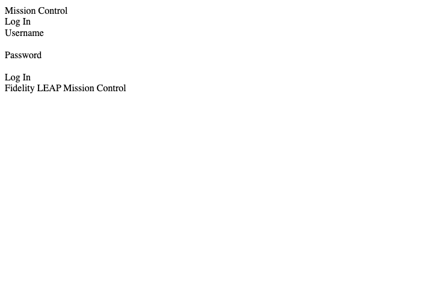
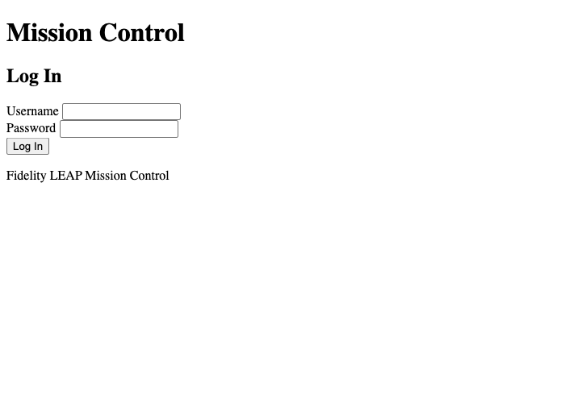
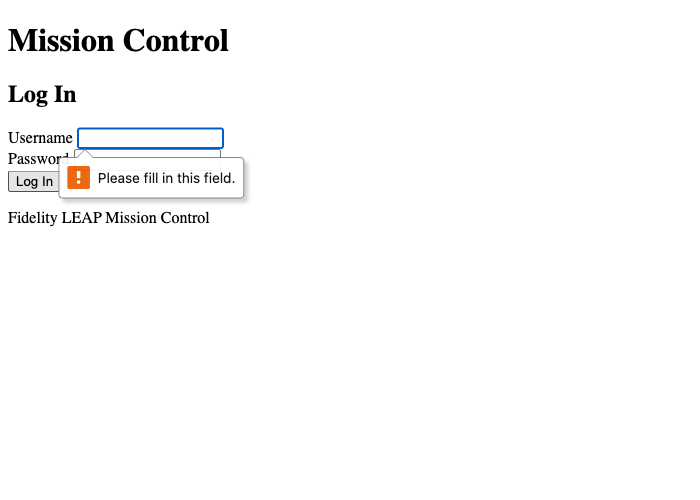
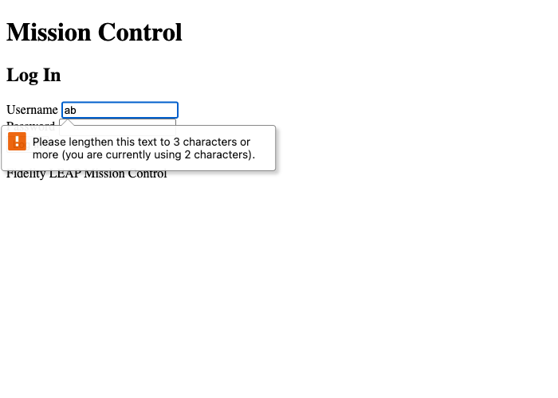

# Module 1 Demo Guide — HTML Fundamentals: Structure, Semantic Elements & Forms

**Duration:** 18 minutes
**Prerequisite:** none — this is the sprint's actual starting point.

Today builds the page that Modules 2-4 will style, animate, and wire up to a real
backend. Start from first principles — what HTML actually is — before touching any
comparison or contrast.

## Part 0: What Is HTML? (4 min)

HTML (HyperText Markup **L**anguage) describes the *structure and content* of a page —
headings, paragraphs, forms, links. Not how it looks (CSS, Module 2) and not how it
behaves (JavaScript, Module 3). A browser reads an HTML file and turns it into the page
on screen.

**Elements, tags, and nesting.** Most HTML is made of elements with an opening tag and
a matching closing tag (note the `/`), wrapping some content:

```html
<h1>Mission Control</h1>
```

`<h1>` opens, `Mission Control` is the content, `</h1>` closes. Elements nest inside
each other, forming a tree:

```html
<form>
  <label>Username</label>
  <input>
</form>
```

`<label>` and `<input>` are both *inside* `<form>` — this tree is exactly what Module 3
calls "the DOM."

**Void elements.** A few elements never wrap content and have no closing tag at all —
`<input>`, `<meta>`, `<br>`. They're complete in a single tag.

**Attributes.** Extra information attached to an opening tag, as `name="value"` pairs:

```html
<input type="text" id="username" required>
```

`type`, `id`, and `required` are all attributes of this one `<input>`. `required` is a
*boolean* attribute — just naming it turns it on, no value needed.

**Comments.** `<!-- like this -->` — ignored completely by the browser, used to leave
notes for humans. This is exactly what the TODOs in today's lab starter file are.

## Part 0.5: Creating and Testing a Page (2 min)

No install, no build tool, no compiler. A `.html` file **is** the finished thing:

1. Write it in any plain-text editor (VS Code, Notepad, TextEdit in plain-text mode —
   never a word processor, which saves formatting you don't want).
2. Save it with a `.html` extension.
3. Open it by double-clicking the file, dragging it into a browser window, or
   File → Open in the browser. No server needed.

To look under the hood of *any* page on the real internet: right-click → "View Page
Source" shows the raw HTML as written; "Inspect" shows the live, rendered tree
(what Module 3 works with directly, not always identical to the source once JavaScript
has run).

## Part 1: The Real Document, Line by Line (3 min)

Open `login-page.html` and walk the top of the file:

```html
<!DOCTYPE html>
<html lang="en">
<head>
  <meta charset="UTF-8" />
  <title>Mission Control - Login</title>
</head>
<body>
```

- `<!DOCTYPE html>` — always the first line; tells the browser to parse this as modern
  HTML.
- `<html lang="en">` — the root element, wraps the whole page; `lang` is what lets
  screen readers and translation tools know what language they're dealing with.
- `<head>` — metadata *about* the page. Nothing in here is visible content.
  `<meta charset="UTF-8">` sets text encoding; `<title>` sets the browser tab's text —
  it's the ONLY part of `<head>` most people ever notice.
- `<body>` — everything the user actually sees lives here.

## Part 2: Same Content, No CSS — Bad vs. Semantic (5 min)

Open `bad-example.html` and `login-page.html` side by side — same visible words
(Mission Control, Log In, Username, Password), zero CSS in either file.

Verified real output, rendered with no stylesheet at all:

**`bad-example.html`** (every element is a `<div>`, an `onclick` attribute stands in
for a button, `contenteditable="true"` stands in for text inputs):



A wall of undifferentiated text. No visible input boxes. No visible button. Nothing
distinguishes "Username" the label from "Log In" the (fake) button.

**`login-page.html`** (`<header>`, `<main>`, `<form>`, `<label>`, real `<input>` and
`<button>` elements):



Immediately recognisable as a login form — bordered input boxes, a distinct button —
with **zero CSS written**. The browser's own default styling for real form elements
does this for free.

**Land the point**: semantic HTML isn't a style choice, it's information. The browser
(and every tool downstream of it) can only treat something like a text input, a
button, or a heading if the markup actually says so — a `<div>` is not "waiting" to
become an input; it never will become one, no matter how it's styled.

### Prove it with the accessibility tree, not just eyes

This is the concrete version of "screen readers can't use div soup" — query each
page's accessibility tree directly (exactly what a screen reader does):

Verified real output, `bad-example.html`:
```
generic
generic
generic "Log In"
```

Verified real output, `login-page.html`:
```
textbox "Username" type="text"
textbox "Password" type="password"
button "Log In" type="submit"
```

The semantic version gives assistive technology (and search engines, and browser
autofill, and password managers) an actual textbox and an actual button. The div-soup
version gives them three anonymous, interactive-in-name-only blobs — `contenteditable`
looks like a text box once styled, but it was never actually one.

## Part 3: Forms and Native Validation (4 min)

Walk through `login-page.html`'s form, live:

```html
<label for="username">Username</label>
<input
  type="text"
  id="username"
  name="username"
  required
  minlength="3"
  autocomplete="username"
/>
```

**`<label for="...">` matched to the input's `id`** is not decorative — click the label
text itself and the input focuses. That association is also what a screen reader
announces before reading the input's value.

Submit the form with the username field empty.

Verified real output (the browser's own, unstyled validation bubble):



Type two characters into username (`minlength="3"`) and submit again.

Verified real output:



**Land the point**: this validation cost zero JavaScript. `required` and `minlength`
are attributes, not code — the browser enforces them and writes its own message.
Module 3 will show what happens when this isn't enough (custom rules, custom
messages); today's job is knowing what the platform already gives you before reaching
for anything else.

## Key message

Every visual and functional advantage `login-page.html` has over `bad-example.html`
came from using the right element for the job, not from writing more code — often from
writing less. Modules 2-4 build directly on top of this same file: CSS styles it,
JavaScript makes it interactive, `fetch()` wires it to `sprint8-auth-service`'s real
`/login` endpoint.

## Transition to the Lab

Learners build their own version of this login page from an empty file — semantic
structure, a properly labelled form, and native validation attributes — verified the
same way today's demo was: submit it empty, read the browser's own validation message.
