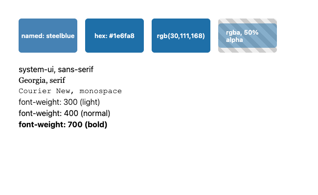

# Module 2 Demo Guide — CSS Fundamentals: Selectors, the Box Model & Layout

**Duration:** 30 minutes
**Prerequisite:** Module 1's login page.

Module 1 said plainly: HTML describes structure and content, not how a page looks.
Today is "how it looks" — the same page, the same elements, restyled from nothing.

## Part 0: What Is CSS, and How Does It Attach to HTML? (3 min)

CSS (Cascading Style Sheets) describes *presentation* — colour, spacing, layout, size —
separately from the HTML that describes structure. Three ways to attach it to a page,
in order of how much you should actually use them:

```html
<!-- 1. Inline - on one element, via the style attribute. -->
<!-- Avoid this: it can't be reused, and it's the highest -->
<!-- specificity there is, making it hard to override later. -->
<h1 style="color: red;">Mission Control</h1>

<!-- 2. Internal - a <style> block in <head>. Fine for a -->
<!-- single throwaway page (today's specificity-demo.html -->
<!-- uses this), but doesn't scale past one file. -->
<style>
  h1 { color: red; }
</style>

<!-- 3. External - a separate .css file, linked once. -->
<!-- What every real project actually uses: one -->
<!-- stylesheet, reused across every page that needs it, -->
<!-- cached by the browser separately from the HTML. -->
<link rel="stylesheet" href="styles.css" />
```

Open `login-page.html` and point at the `<link>` tag in `<head>` — that's the entire
connection to `styles.css`. Nothing else wires them together.

## Part 0.5: The Structure of a Stylesheet (2 min)

A CSS file is a sequence of *rules*. Each rule is a selector plus a declaration block:

```css
selector {
  property: value;
  property: value;
}
```

Point at a real rule in `styles.css`:

```css
.field label {
  font-size: 0.875rem;
  font-weight: 600;
  color: #333;
}
```

`.field label` is the *selector*; everything inside `{ }` is the *declaration block*;
each `property: value;` line is one *declaration*. That's the entire vocabulary — every
CSS file, however large, is built from nothing but rules made of declarations.

**Comments**: `/* like this */` — the same idea as HTML's `<!-- -->`, ignored by the
browser, notes for humans. `styles.css` already uses these to explain *why* a rule
exists, not just *what* it does — the box-sizing comment at the top is a good example.

**@-rules**: anything starting with `@` does something other than "style a selector."
`@media` (Part 5) wraps a whole block behind a condition; other @-rules exist
(`@import` pulls in another stylesheet, `@font-face` defines a custom font) but aren't
needed today.

**File order matters, too — not just specificity**: when two rules have *equal*
specificity, the one written *later* in the file wins. Part 1's specificity example
had rules of different specificity, so order didn't matter there; when specificity
ties, order is the tiebreaker.

## Part 1: Selectors & Specificity (4 min)

Three basic selector types, all real, all in `styles.css`:

```css
header { background: #0a2c24; }     /* element selector - EVERY header */
.field { display: flex; }            /* class selector - anything class="field" */
#login-form { }                      /* id selector - the ONE element with that id */
```

**Specificity**: when more than one rule targets the same element, the browser has to
pick a winner. Open `specificity-demo.html` — three rules all set the border colour of
the *same* input:

```css
input { border-color: black; }
.field input { border-color: blue; }
#username { border-color: red; }
```

Verified real output:


Red wins. An id selector (`#username`) is more specific than a class selector
(`.field input`), which is more specific than a plain element selector (`input`) — id
beats class beats element, and inline `style="..."` beats all three. This is exactly
why inline styles are trouble: nothing in an external stylesheet can ever out-specify
them without resorting to `!important`, which just moves the problem.

## Part 2: Colour, Backgrounds & Text (5 min)

Every property so far has been about *position*. Now the properties that actually make
a page look designed. Open `colors-fonts-demo.html`:



**Colour has three common formats** — all valid, all used in real projects:

```css
color: steelblue;              /* 1. named - ~150 exist, easy to read */
color: #1e6fa8;                 /* 2. hex - most common in real projects */
color: rgb(30, 111, 168);       /* 3. rgb() - identical to the hex above */
background: rgba(30, 111, 168, 0.5);  /* rgba() adds ALPHA: 0 = invisible, 1 = solid */
```

The hex swatch and the `rgb()` swatch in the screenshot are the *exact same colour* —
two notations for one value. `rgba()`'s fourth number is the only way to get real
transparency; the chequered background showing through the fourth swatch is that alpha
channel, verified, not simulated.

**`color` vs `background`** — easy to mix up by name alone:

```css
header {
  background: #0a2c24;   /* the element's OWN background */
  color: white;           /* the TEXT colour inside it */
}
```

This is a real rule from `styles.css` — that's why the header is dark green with white
text, not the other way round.

**Fonts** — also real rules from `styles.css`:

```css
font-family: system-ui, sans-serif;
```

`system-ui` is the operating system's own native UI font — no download, renders
instantly, looks "native" on whatever device it's viewed on. `sans-serif` is a
*fallback*: if a browser doesn't recognise `system-ui`, it falls back to any generic
sans-serif font rather than showing nothing. This comma-separated list is called a
*font stack*. The demo screenshot's second and third lines of text show two other
families entirely (`Georgia, serif` and `"Courier New", monospace`) for contrast.

```css
.field label {
  font-size: 0.875rem;   /* relative to the ROOT element's font size */
}
```

`rem` scales if a user changes their browser's default text size (an accessibility
setting); a fixed `px` value never would. `styles.css` uses `rem` for every
`font-size` for exactly this reason — worth pointing out as a deliberate choice, not
an accident.

```css
font-weight: 600;   /* 400 = normal, 700 = bold - numbers give finer control */
```

The demo screenshot's three weight lines (300/400/700) show visibly different
boldness from the same font family — `font-weight` is independent of which font is
loaded.

One more real property, purely visual, *not* part of the box model despite sitting
right next to `border`: `border-radius: 8px;` on `form` — rounds the corners. It
doesn't add space like padding/margin do; it just changes the shape of the box that's
already there.

## Part 3: The Box Model (5 min)

Every element on a page is a box with four layers, from the inside out. Open
`box-model-demo.html`:


- **Content** (blue) — the actual text or child elements.
- **Padding** (yellow) — space *inside* the border, between the border and the content.
- **Border** (the dashed line) — drawn right at the edge of the padding.
- **Margin** (orange) — space *outside* the border, pushing other elements away.

**The gotcha**: by default, `width`/`height` set only the CONTENT box — padding and
border get added on *top* of that, making the element bigger than the width you typed.
`styles.css`'s first real rule fixes this globally:

```css
* {
  box-sizing: border-box;
}
```

With `border-box`, `width` includes padding and border — the number you write is the
number you get. Point at `form { max-width: 360px; padding: 32px; }` in the real
stylesheet: without `border-box`, that form would render 64px wider than 360px (32px
padding on each side). With it, 360px means 360px.

## Part 4: Layout With Flexbox (5 min)

Open `styles.css`'s `main` rule:

```css
main {
  flex: 1;
  display: flex;
  justify-content: center;
  align-items: center;
  padding: 24px;
}
```

`display: flex` turns `main` into a flex container. `justify-content: center` centres
its children horizontally; `align-items: center` centres them vertically. Two
properties, and the login form sits dead centre in whatever space is left between the
header and footer — no manual pixel math, no absolute positioning.

The form itself is *also* a flex container, stacked the other way:

```css
form {
  display: flex;
  flex-direction: column;
  gap: 16px;
}
```

`flex-direction: column` stacks children top to bottom instead of side by side; `gap`
puts consistent space between them without a single `margin` on any individual field.

Verified real output, the whole page together:


## Part 5: Responsive Basics — Media Queries (3 min)

`styles.css` ends with one breakpoint:

```css
@media (max-width: 480px) {
  main {
    padding: 0;
  }
  form {
    max-width: none;
    border: none;
    border-radius: 0;
  }
}
```

`@media (max-width: 480px)` means "apply everything inside this block only when the
viewport is 480px wide or narrower." Below that width, there's no room to spare for a
floating card with margins on both sides — the form drops its border, its rounded
corners, and its `max-width`, going edge-to-edge instead.

Verified real output, the same file, same CSS, a narrower viewport:


Nothing in the HTML changed. Nothing in the *rest* of the CSS changed. One `@media`
block is the entire difference between these two screenshots.

## Part 6: Best Practices for Managing Styles (3 min)

A handful of habits that matter more as a stylesheet grows past one page:

- **Prefer classes over ids for styling.** `#login-form` exists in the HTML, but
  `styles.css` never actually styles *by* that id — deliberately. Ids carry heavy
  specificity that's hard to override later (Part 1), and are better reserved for
  unique hooks — JavaScript will grab this exact one in Module 3.
- **Avoid `!important`.** It doesn't fix a specificity conflict, it ends the
  conversation by force — the next `!important` (or a browser extension, or a
  different developer six months from now) has to fight it too. Fix the selector
  instead.
- **Keep a consistent order in the file.** `styles.css` follows a common shape: reset
  first (`box-sizing`), then page-level layout (`body`, `header`, `main`, `footer`),
  then components (`form`, `.field`, `button`), then responsive overrides *last*. A
  stylesheet that follows one predictable order is far easier to scan than one where
  rules appear in whatever sequence they were written.
- **Be consistent with units.** `rem` for anything text-related (respects a user's
  accessibility settings); `px` for things that genuinely should never scale, like a
  1px hairline border. Mixing them arbitrarily makes a stylesheet's behaviour
  unpredictable.
- **Name classes for what something *is*, not what it currently looks like.** `.field`
  describes a form field's role. If the design later changes the colour scheme,
  `.field` still reads correctly; a class called `.blue-box` would immediately become
  a lie the moment the design changed.
- **BEM** (Block\_\_Element--Modifier) is one common naming convention for larger
  projects — worth knowing the name if it shows up in a real codebase, even though a
  page this size doesn't need it.

## Key message

Every visual decision today came from a small, composable set of tools: a selector to
target something, a colour/font property to style it, a box-model property to space
it, a flex property to position it, and a media query to adapt it — not from
trial-and-error pixel-pushing. Module 8 (Angular components) will style pieces of a
page the same way, just scoped to one component instead of a whole file.

## Transition to the Lab

Learners take Module 1's own login page — unstyled — and rebuild this same result
themselves: an external stylesheet, correct box-model spacing, a Flexbox layout, and
one working breakpoint, verified the same way today's demo was, by comparing
screenshots at two viewport widths.
