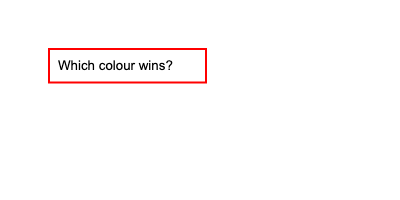
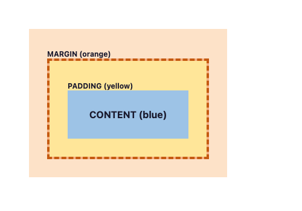
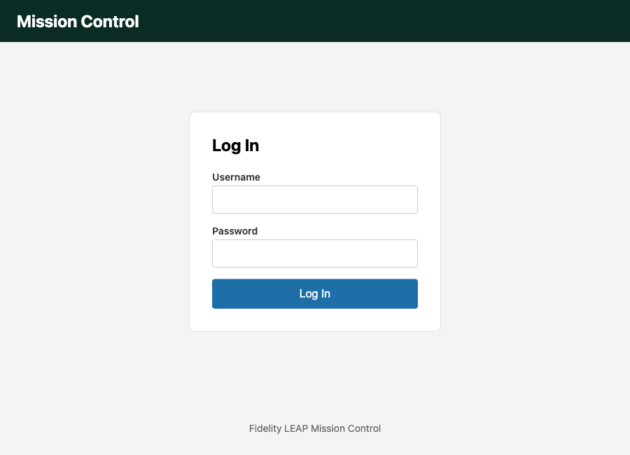
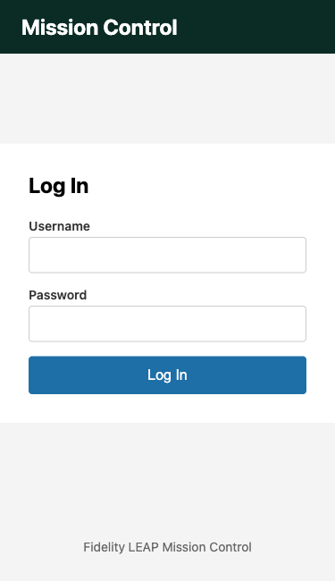

# Module 2 Demo Guide — CSS Fundamentals: Selectors, the Box Model & Layout

**Duration:** 20 minutes
**Prerequisite:** Module 1's login page.

Module 1 said plainly: HTML describes structure and content, not how a page looks.
Today is "how it looks" — the same page, the same elements, restyled from nothing.

## Part 0: What Is CSS, and How Does It Attach to HTML? (3 min)

CSS (Cascading Style Sheets) describes *presentation* — colour, spacing, layout, size —
separately from the HTML that describes structure. Three ways to attach it to a page,
in order of how much you should actually use them:

```html
<!-- 1. Inline - on one element, via the style attribute. -->
<!-- Avoid this: it can't be reused, and it's the highest -->
<!-- specificity there is, making it hard to override later. -->
<h1 style="color: red;">Mission Control</h1>

<!-- 2. Internal - a <style> block in <head>. Fine for a -->
<!-- single throwaway page (today's specificity-demo.html -->
<!-- uses this), but doesn't scale past one file. -->
<style>
  h1 { color: red; }
</style>

<!-- 3. External - a separate .css file, linked once. -->
<!-- What every real project actually uses: one -->
<!-- stylesheet, reused across every page that needs it, -->
<!-- cached by the browser separately from the HTML. -->
<link rel="stylesheet" href="styles.css" />
```

Open `login-page.html` and point at the `<link>` tag in `<head>` — that's the entire
connection to `styles.css`. Nothing else wires them together.

## Part 1: Selectors & Specificity (4 min)

Three basic selector types, all real, all in `styles.css`:

```css
header { background: #0a2c24; }     /* element selector - EVERY header */
.field { display: flex; }            /* class selector - anything class="field" */
#login-form { }                      /* id selector - the ONE element with that id */
```

**Specificity**: when more than one rule targets the same element, the browser has to
pick a winner. Open `specificity-demo.html` — three rules all set the border colour of
the *same* input:

```css
input { border-color: black; }
.field input { border-color: blue; }
#username { border-color: red; }
```

Verified real output:



Red wins. An id selector (`#username`) is more specific than a class selector
(`.field input`), which is more specific than a plain element selector (`input`) — id
beats class beats element, and inline `style="..."` beats all three. This is exactly
why inline styles are trouble: nothing in an external stylesheet can ever out-specify
them without resorting to `!important`, which just moves the problem.

## Part 2: The Box Model (5 min)

Every element on a page is a box with four layers, from the inside out. Open
`box-model-demo.html`:



- **Content** (blue) — the actual text or child elements.
- **Padding** (yellow) — space *inside* the border, between the border and the content.
- **Border** (the dashed line) — drawn right at the edge of the padding.
- **Margin** (orange) — space *outside* the border, pushing other elements away.

**The gotcha**: by default, `width`/`height` set only the CONTENT box — padding and
border get added on *top* of that, making the element bigger than the width you typed.
`styles.css`'s first real rule fixes this globally:

```css
* {
  box-sizing: border-box;
}
```

With `border-box`, `width` includes padding and border — the number you write is the
number you get. Point at `form { max-width: 360px; padding: 32px; }` in the real
stylesheet: without `border-box`, that form would render 64px wider than 360px (32px
padding on each side). With it, 360px means 360px.

## Part 3: Layout With Flexbox (5 min)

Open `styles.css`'s `main` rule:

```css
main {
  flex: 1;
  display: flex;
  justify-content: center;
  align-items: center;
  padding: 24px;
}
```

`display: flex` turns `main` into a flex container. `justify-content: center` centres
its children horizontally; `align-items: center` centres them vertically. Two
properties, and the login form sits dead centre in whatever space is left between the
header and footer — no manual pixel math, no absolute positioning.

The form itself is *also* a flex container, stacked the other way:

```css
form {
  display: flex;
  flex-direction: column;
  gap: 16px;
}
```

`flex-direction: column` stacks children top to bottom instead of side by side; `gap`
puts consistent space between them without a single `margin` on any individual field.

Verified real output, the whole page together:



## Part 4: Responsive Basics — Media Queries (3 min)

`styles.css` ends with one breakpoint:

```css
@media (max-width: 480px) {
  main {
    padding: 0;
  }
  form {
    max-width: none;
    border: none;
    border-radius: 0;
  }
}
```

`@media (max-width: 480px)` means "apply everything inside this block only when the
viewport is 480px wide or narrower." Below that width, there's no room to spare for a
floating card with margins on both sides — the form drops its border, its rounded
corners, and its `max-width`, going edge-to-edge instead.

Verified real output, the same file, same CSS, a narrower viewport:



Nothing in the HTML changed. Nothing in the *rest* of the CSS changed. One `@media`
block is the entire difference between these two screenshots.

## Key message

Every visual decision today came from a small, composable set of tools: a selector to
target something, a box-model property to space it, a flex property to position it,
and a media query to adapt it — not from trial-and-error pixel-pushing. Module 8
(Angular components) will style pieces of a page the same way, just scoped to one
component instead of a whole file.

## Transition to the Lab

Learners take Module 1's own login page — unstyled — and rebuild this same result
themselves: an external stylesheet, correct box-model spacing, a Flexbox layout, and
one working breakpoint, verified the same way today's demo was, by comparing
screenshots at two viewport widths.
