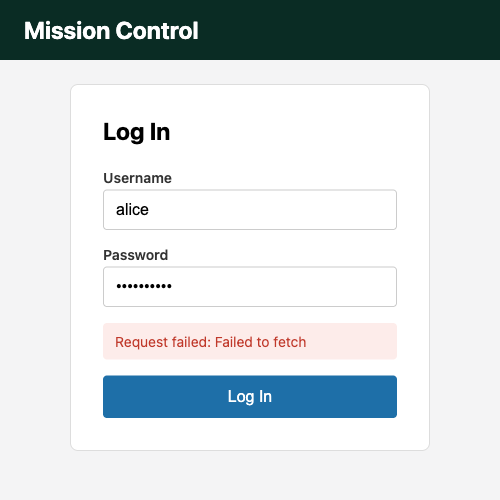
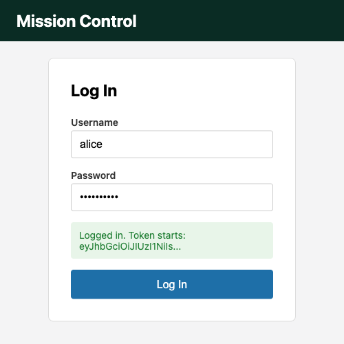
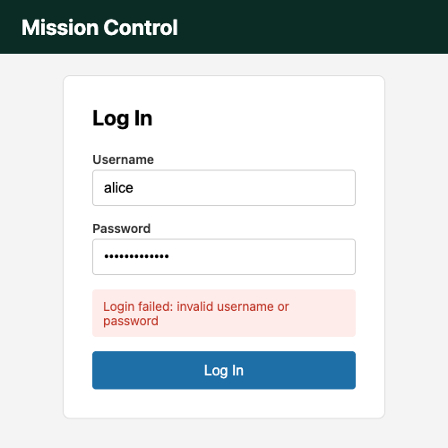

# Module 4 Demo Guide — Fetch & Browser HTTP: Calling a Real API Without a Framework

**Duration:** 30 minutes
**Prerequisite:** Module 3's interactive login page. Sprint 8's `sprint8-auth-service`
running on `http://localhost:3000`, served from a page on `http://localhost:8000` (e.g.
`python3 -m http.server 8000` from this folder) - **not** opened as a `file://` URL. Fetch's
CORS rules need a real origin to demonstrate honestly; see Part 2 for why.

Sprint 6/7 built the mission service. Sprint 8 built the auth service that protects it.
Modules 1-3 built a page that can validate its own form. Today that page talks to a real,
running backend for the first time - no framework, just `fetch()`.

## Part 0: The Fetch API and the Request/Response Model (3 min)

Every HTTP interaction is a *request* going out and a *response* coming back - the same
model `curl` has always used, now callable from JavaScript:

```javascript
const response = await fetch(url, {
  method: "POST",
  headers: { "Content-Type": "application/json" },
  body: JSON.stringify({ username, password }),
});
```

`fetch()` returns a `Promise` that resolves once the response's *headers* have arrived - not
once the whole body has downloaded. Reading the body itself is a second, separate step
(`response.json()`), also a `Promise`. That's why the code above needs `await` twice, once
per step.

## Part 1: async/await, Not .then() Chains (4 min)

`fetch()` predates `async`/`await` in JavaScript's history, so most examples online still
show `.then()` chains. `async`/`await` is the same thing, written to read top-to-bottom
instead of nested:

```javascript
form.addEventListener("submit", async (event) => {
  event.preventDefault();
  const response = await fetch(AUTH_URL, { ... });
  const data = await response.json();
  showMessage(`Logged in. Token starts: ${data.accessToken.slice(0, 20)}...`, "success");
});
```

The event listener's own callback is marked `async` - that's what makes `await` legal
inside it. Nothing here is Sprint 8-specific; this is the exact same `async`/`await` syntax,
just running against `fetch()` instead of a database call.

## Part 2: A Real CORS Failure, Verified (5 min)

Point at `script.js`'s `AUTH_URL` - `http://localhost:3000`. This page is served from
`http://localhost:8000`. Different port, different *origin* - and browsers block
cross-origin requests by default unless the server explicitly allows it. Submit the login
form now, before any fix:



Actually run it live rather than trusting a screenshot - open DevTools' Console tab and
submit. The real error reads:

```
Access to fetch at 'http://localhost:3000/auth/login' from origin 'http://localhost:8000'
has been blocked by CORS policy: Response to preflight request doesn't pass access control
check: No 'Access-Control-Allow-Origin' header is present on the requested resource.
```

**This is not a bug in `script.js`.** CORS is enforced by the browser, checking a header the
*server* controls. No amount of client-side code can work around it - the fix has to happen
on `sprint8-auth-service`.

## Part 3: The Fix Is One Line, on the Server (2 min)

In `sprint8-auth-service`'s `main.ts`:

```typescript
const app = await NestFactory.create(AppModule);
app.enableCors({ origin: "http://localhost:8000" });
```

`enableCors()` adds the `Access-Control-Allow-Origin` header the browser was checking for.
Restart the service. Submit the exact same form again, no other change:



The token shown is real, truncated only for display - the same shape of token Sprint 8,
Module 15 verified against the mission service directly.

## Part 4: fetch() Doesn't Reject on HTTP Errors - Check response.ok (5 min)

Submit the form with a wrong password now:



The important, easy-to-miss detail: `fetch()`'s promise only *rejects* on a network-level
failure - DNS lookup fails, the connection is refused, or (Part 2) CORS blocks it entirely.
A `401 Unauthorized` or `500 Internal Server Error` still counts as "the request completed
successfully" as far as `fetch()` is concerned - it resolves normally, with `response.ok`
set to `false`:

```javascript
if (!response.ok) {
  const body = await response.json();
  showMessage(`Login failed: ${body.message}`, "error");
  return;
}
```

Skipping this check is the single most common `fetch()` mistake - code that only handles
the `catch` block silently treats every 401 and 500 as a success, because nothing ever threw.

## Part 5: try/catch/finally Around the Whole Thing (4 min)

```javascript
try {
  const response = await fetch(AUTH_URL, { ... });
  if (!response.ok) { ... }
  const data = await response.json();
  showMessage(`Logged in. Token starts: ${data.accessToken.slice(0, 20)}...`, "success");
} catch (err) {
  // A network failure (service down, CORS block) lands here, NOT
  // in the response.ok check above.
  console.error("fetch() rejected:", err);
  showMessage(`Request failed: ${err.message}`, "error");
} finally {
  submitBtn.disabled = false;
}
```

Three distinct outcomes, three distinct places they're handled: success falls through to
the bottom of `try`; an HTTP-level failure (401, 500) is caught by the `response.ok` check,
still inside `try`; a network-level failure (Part 2's CORS block, or the service simply not
running) is the only thing that reaches `catch`. `finally` re-enables the submit button
regardless of which of the three happened - `async`/`await` with `try`/`catch`/`finally`
reads almost exactly like synchronous code, despite everything inside being asynchronous.

## Key message

`fetch()` plus `async`/`await` is the entire vocabulary: send a request, `await` the
response, check `response.ok`, `await` the body, wrap it all in `try`/`catch`/`finally` for
the failure modes a real network actually has. Module 10's `HttpClient` will do the same job
with fewer lines and built-in error typing - but it's solving the exact same three problems
this module just solved by hand.

## Transition to the Lab

Learners take Module 3's own login page and connect it to the real
`sprint8-auth-service`: a `fetch()` call with `async`/`await`, a `response.ok` check for
invalid credentials, and a `catch` block for a network-level failure - rendering all three
outcomes into the DOM, verified with real screenshots the same way today's demo was.
