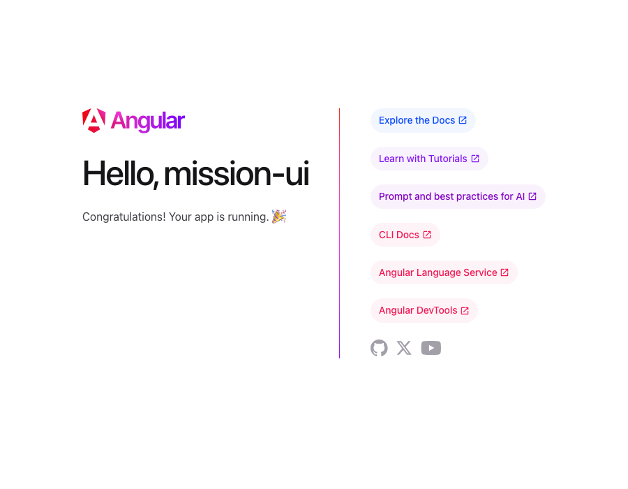

# Module 7 Demo Guide — Angular Project Structure, Dev Server & Build Tooling

**Duration:** 25 minutes
**Prerequisite:** Module 6's conceptual read-through. Node.js 22.22.3+ or 24.15.0+ and the
Angular CLI (`npm install -g @angular/cli`, or use `npx @angular/cli` as this demo does).
This sprint targets **Angular 21** and **TypeScript 5.9** specifically, not whatever's
newest — pin the CLI version explicitly (`npx @angular/cli@21`) rather than `@latest`.

Module 6 read Angular code without running it. Today scaffolds a real, running project for
the first time — no hand-written `index.html` this time, the CLI generates it.

## Part 0: Scaffolding With the CLI, Live (5 min)

```bash
npx @angular/cli@21 new mission-ui --routing --style=css --ssr=false --skip-git
```

Run it live, let the real output scroll: `CREATE mission-ui/angular.json`,
`CREATE mission-ui/src/app/app.ts`, and so on, ending with a real `npm install`. `--routing`
scaffolds `app.routes.ts` up front (Module 14 fills it in); `--style=css` picks plain CSS,
the same language Module 2 already taught; `--ssr=false` keeps this a pure browser app, no
server-rendering complexity this sprint needs.

## Part 1: The Generated Structure, Walked Through (7 min)

Open the real generated tree:

```
mission-ui/
├── angular.json          - CLI/build configuration (Part 3)
├── package.json          - dependencies + npm scripts (start, build, test)
├── tsconfig.json          - Sprint 8's TypeScript config, Angular-flavoured
├── src/
│   ├── main.ts            - the entry point, bootstraps the app
│   ├── index.html          - the ONE real HTML file - Angular renders into it
│   ├── styles.css          - global styles (Module 2's CSS, project-wide)
│   └── app/
│       ├── app.ts          - the root component (Module 6's MissionStatusComponent, for real)
│       ├── app.html        - the root component's template
│       ├── app.css         - the root component's own styles
│       ├── app.config.ts   - app-wide providers (router, HTTP client - Module 10)
│       └── app.routes.ts   - the route table (empty until Module 14)
└── public/favicon.ico
```

Point at `src/app/app.ts` — this is Module 6's own pattern, generated for real:

```typescript
import { Component, signal } from '@angular/core';
import { RouterOutlet } from '@angular/router';

@Component({
  selector: 'app-root',
  imports: [RouterOutlet],
  templateUrl: './app.html',
  styleUrl: './app.css'
})
export class App {
  protected readonly title = signal('mission-ui');
}
```

Two things worth naming explicitly against Module 6's version: current Angular CLI no longer
writes `standalone: true` — it's the *default* for every component now, so the property is
simply omitted; and `templateUrl`/`styleUrl` point at separate files here instead of an
inline template string — both are valid, the CLI's default is just to split them into
`app.html`/`app.css` for anything beyond a trivial component.

## Part 2: The Dev Server, Running for Real (6 min)

```bash
npx ng serve --port 4300
```

Real output:

```
Application bundle generation complete. [1.071 seconds]
Watch mode enabled. Watching for file changes...
  ➜  Local:   http://localhost:4300/
```

Verified real output, the actual page a browser loads at that URL:



This isn't Module 4's `python3 -m http.server` serving a static file — `ng serve` compiles
TypeScript, processes the templates, and rebuilds automatically the moment a source file
changes, pushing the update to the browser without a manual refresh. Change `app.html`'s
text live and watch the browser update on its own.

## Part 3: Build Tooling — What angular.json and ng build Actually Do (5 min)

`angular.json`'s `architect.build` section names the actual build system:
`@angular/build:application` — Angular's own builder, built on **esbuild** (bundling) and
**Vite** (the dev server) as of recent Angular versions, chosen for speed over the older
Webpack-based toolchain.

```bash
npx ng build
```

Real output:

```
Initial chunk files | Names         |  Raw size | Estimated transfer size
main-MBZGHETV.js    | main          | 214.72 kB |                58.92 kB
styles-5INURTSO.css | styles        |   0 bytes |                 0 bytes
Application bundle generation complete. [1.664 seconds]
Output location: .../mission-ui/dist/mission-ui
```

`ng build` produces optimised, production-ready static files in `dist/` — no dev server, no
watch mode, just HTML/CSS/JS ready to deploy anywhere a static file can be served from.
`angular.json`'s `budgets` (visible under the `production` configuration) fail the build if
that output grows past a size threshold — a guardrail against a bundle silently bloating as
a real app grows.

## Key message

The CLI's whole job is removing the setup decisions Module 4's raw `fetch()`/`http.server`
approach left entirely manual: where files live, how TypeScript compiles, how the dev
server rebuilds on change, and how a production bundle gets built — one command each,
consistent across every Angular project, not reinvented per app.

## Transition to the Lab

Learners scaffold `mission-ui` themselves (this exact command), get `ng serve` running, and
verify it in a browser — the actual project this sprint's remaining modules build inside,
starting today.
