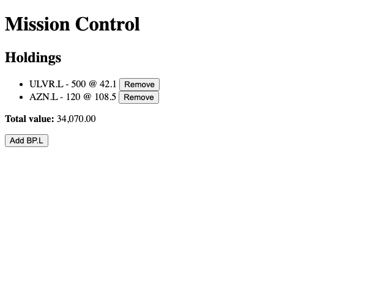
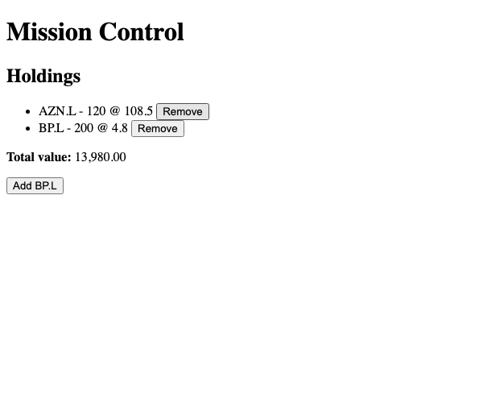

# Module 8 Demo Guide — Components & Templates: Standalone Components & Signals

**Duration:** 30 minutes
**Prerequisite:** Module 7's `mission-ui` project, `ng serve` working.

Module 6 read Angular code. Module 7 scaffolded a real project. Today builds the first real
piece of it — a genuine, generated, working component with local state.

## Part 0: Generating a Component With the CLI (4 min)

```bash
npx ng generate component holdings-summary --standalone
```

Real output:

```
CREATE src/app/holdings-summary/holdings-summary.css (0 bytes)
CREATE src/app/holdings-summary/holdings-summary.spec.ts (595 bytes)
CREATE src/app/holdings-summary/holdings-summary.ts (225 bytes)
CREATE src/app/holdings-summary/holdings-summary.html (31 bytes)
```

Four files, one component: a `.ts` (logic), `.html` (template), `.css` (styles scoped to
just this component), and a `.spec.ts` (Module 16's unit test starting point, untouched
today). Point out the naming: current Angular CLI drops the word "Component" from both the
class name (`HoldingsSummary`, not `HoldingsSummaryComponent`) and every filename — an
intentional recent style change, not a typo.

## Part 1: A Signal for Local State (7 min)

Open the generated `holdings-summary.ts` and build it up live:

```typescript
interface Holding {
  ticker: string;
  quantity: number;
  price: number;
}

export class HoldingsSummary {
  protected readonly holdings = signal<Holding[]>([
    { ticker: 'ULVR.L', quantity: 500, price: 42.1 },
    { ticker: 'AZN.L', quantity: 120, price: 108.5 },
  ]);

  protected readonly totalValue = computed(() =>
    this.holdings().reduce((sum, h) => sum + h.quantity * h.price, 0),
  );
}
```

`interface Holding` is plain TypeScript, straight from Sprint 8 — nothing Angular about it.
`signal<Holding[]>([...])` is the local state itself, seeded with two starter rows so the
template has something real to render immediately. `computed()` derives `totalValue` from
`holdings` — it will recalculate on its own the moment `holdings` changes, with no code
anywhere that manually recomputes it.

## Part 2: The Template — HTML Plus Angular Syntax (8 min)

```html
<section class="holdings-summary">
  <h2>Holdings</h2>
  <ul>
    @for (holding of holdings(); track holding.ticker) {
      <li>
        {{ holding.ticker }} - {{ holding.quantity }} @ {{ holding.price }}
        <button (click)="removeHolding(holding.ticker)">Remove</button>
      </li>
    } @empty {
      <li>No holdings.</li>
    }
  </ul>
  <p><strong>Total value:</strong> {{ totalValue() | number: '1.2-2' }}</p>
  <button (click)="addHolding()">Add BP.L</button>
</section>
```

Everything here is either plain HTML (`<section>`, `<ul>`, `<li>`, `<button>` — Module 1) or
Angular syntax layered on top of it, exactly as Module 6 named it: `@for`/`@empty` for the
list (`@empty` is new — it renders only when the array is empty, no `if` needed alongside
it), `{{ }}` interpolation, `(click)` event binding, and `| number: '1.2-2'` — a **pipe**,
Angular's syntax for formatting a value inline in the template (two decimal places here),
not seen before today.

## Part 3: Updating a Signal From an Event Handler (6 min)

```typescript
protected addHolding(): void {
  this.holdings.update((current) => [
    ...current,
    { ticker: 'BP.L', quantity: 200, price: 4.8 },
  ]);
}

protected removeHolding(ticker: string): void {
  this.holdings.update((current) => current.filter((h) => h.ticker !== ticker));
}
```

`.update()` takes the *current* value and returns the *new* one — here, a new array via the
spread operator (`addHolding`) or `.filter()` (`removeHolding`), never mutating the old array
in place. This matters more than it looks: a signal decides whether it changed by comparing
the old and new value with `Object.is` — the *same object reference* always compares equal
to itself, mutation or not. Return the same array after `.push()`-ing into it, and the signal
considers itself unchanged, so nothing depending on it (like `computed()`) is told to
recompute. The lab's reflection question walks through exactly what that looks like in
practice — it's more surprising than "nothing updates."

Wire it into `app.html`:

```html
<app-holdings-summary />
```

...and `app.ts`'s `imports: [RouterOutlet, HoldingsSummary]` — a component has to import any
other component it uses in its own template, the same way any TypeScript file imports what
it needs.

## Part 4: Verified, Live (5 min)

Run `ng serve`, open the browser, and interact with it for real:



Click "Add BP.L", then remove ULVR.L:



`34,070.00` becomes `13,980.00` — nobody wrote code to recalculate that total after either
click. `computed()` did it because `totalValue` reads `holdings()`, and `holdings` changed.

## Key message

A component is three things working together: a TypeScript class holding state (signals)
and behaviour (methods), a template that's HTML plus Angular's own syntax, and a decorator
connecting the two. Nothing here needed a service, DI, or HTTP — Module 9 is exactly about
what happens when this local state needs to be shared with more than one component.

## Transition to the Lab

Learners build their own first component in their own `mission-ui`, using a signal for
local state the same way — verified by actually running it, not just writing code that
looks plausible.
