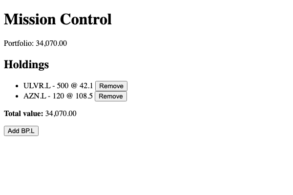
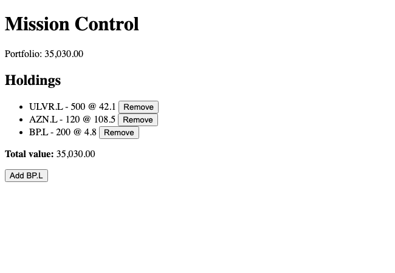

# Module 9 Demo Guide — Services & Dependency Injection in Angular

**Duration:** 30 minutes
**Prerequisite:** Module 8's `HoldingsSummary` component, holding its own local signal state.
Angular 21, TypeScript 5.9 (this sprint's pinned toolchain).

Module 8 built one component that owns its own state. Today asks the obvious next question:
what happens when a *second* component needs the same data?

## Part 0: The Problem — State Trapped in One Component (3 min)

Point at Module 8's `HoldingsSummary`: `holdings` and `totalValue` live entirely inside it.
If a header badge needed to show the portfolio's total value too, there'd be no clean way to
get it there — copy the signal into a second component (now two sources of truth, easy to
let drift out of sync), or pass it down/up through inputs and outputs (workable for one
level, painful for anything deeper). A **service** is Angular's answer: state and logic that
lives outside any one component, that multiple components can share.

## Part 1: Generating a Service With the CLI (4 min)

```bash
npx ng generate service holdings
```

Real output:

```
CREATE src/app/holdings.spec.ts (331 bytes)
CREATE src/app/holdings.ts (82 bytes)
```

Open the generated file:

```typescript
import { Injectable } from '@angular/core';

@Injectable({
  providedIn: 'root',
})
export class Holdings {}
```

`@Injectable` is the decorator that makes a class eligible for dependency injection at all;
`providedIn: 'root'` tells Angular to create exactly one instance for the whole application
(the root injector) rather than requiring it to be listed in every component that needs it.
Worth a brief aside: very recent Angular versions (22+) also ship a newer `@Service()`
decorator that does the same job with a shorter name — this sprint targets Angular 21, where
`@Injectable` is what the CLI generates and what the overwhelming majority of existing
tutorials, Stack Overflow answers, and real codebases still use.

## Part 2: Moving the State In (8 min)

```typescript
import { Injectable, signal, computed } from '@angular/core';

export interface Holding {
  ticker: string;
  quantity: number;
  price: number;
}

@Injectable({
  providedIn: 'root',
})
export class Holdings {
  private readonly holdings = signal<Holding[]>([
    { ticker: 'ULVR.L', quantity: 500, price: 42.1 },
    { ticker: 'AZN.L', quantity: 120, price: 108.5 },
  ]);

  readonly all = this.holdings.asReadonly();
  readonly totalValue = computed(() =>
    this.holdings().reduce((sum, h) => sum + h.quantity * h.price, 0),
  );

  add(holding: Holding): void {
    this.holdings.update((current) => [...current, holding]);
  }

  remove(ticker: string): void {
    this.holdings.update((current) => current.filter((h) => h.ticker !== ticker));
  }
}
```

Everything from Module 8's component moved here unchanged in spirit — `signal`, `computed`,
immutable `.update()` — just relocated. Two new things: `holdings` is now `private` (nothing
outside this class can call `.set()` directly and bypass `add`/`remove`), and
`.asReadonly()` exposes a read-only view (`all`) so a consumer can read the signal but never
write to it.

## Part 3: Injecting It Into a Component (5 min)

```typescript
import { Component, inject } from '@angular/core';
import { Holdings } from '../holdings';

@Component({ ... })
export class HoldingsSummary {
  private readonly holdingsService = inject(Holdings);

  protected readonly holdings = this.holdingsService.all;
  protected readonly totalValue = this.holdingsService.totalValue;

  protected addHolding(): void {
    this.holdingsService.add({ ticker: 'BP.L', quantity: 200, price: 4.8 });
  }

  protected removeHolding(ticker: string): void {
    this.holdingsService.remove(ticker);
  }
}
```

`inject(Holdings)` — Module 6 named this pattern already. The component's `.html` template
doesn't change *at all*: `holdings()` and `totalValue()` are still callable signals, just
sourced from the service instead of the component's own fields.

Rebuild and rerun — behaviour is identical to Module 8's screenshots, proving this refactor
changed *where* the state lives, not *what* the app does:



## Part 4: The Actual Payoff — Sharing State (7 min)

Generate a second component:

```bash
npx ng generate component portfolio-badge --standalone
```

```typescript
export class PortfolioBadge {
  private readonly holdingsService = inject(Holdings);
  protected readonly totalValue = this.holdingsService.totalValue;
}
```

Add `<app-portfolio-badge />` to the header in `app.html`, alongside
`<app-holdings-summary />` in `main`. Both components call `inject(Holdings)` — the
`providedIn: 'root'` in `@Injectable`'s config means both get the *exact same instance*,
not two separate copies.

Verified real output, before and after clicking "Add BP.L" in the holdings list:



`34,070.00` becomes `35,030.00` in **both** places from **one** click, with zero wiring
between the two components — neither one knows the other exists. That's the entire point of
a shared, injectable service.

## Key message

A service is exactly what a component is, minus the template: a class with state and
methods. The difference that matters is *where it lives* — one instance, shared by anything
that injects it, instead of state trapped inside a single component's boundary. Module 8's
`computed()`/immutable-update lessons carried over completely unchanged; only the *location*
of the logic moved.

## Transition to the Lab

Learners perform the exact same extraction on their own `HoldingsSummary`, then build a
second component that injects the same service — verifying, the same way today's demo did,
that two independent components stay in sync through one shared source of truth.
