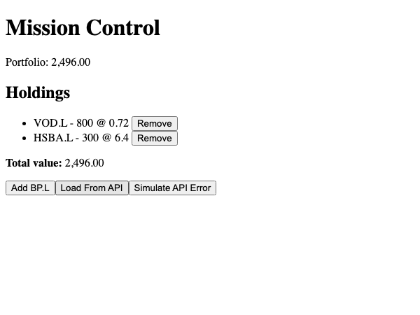
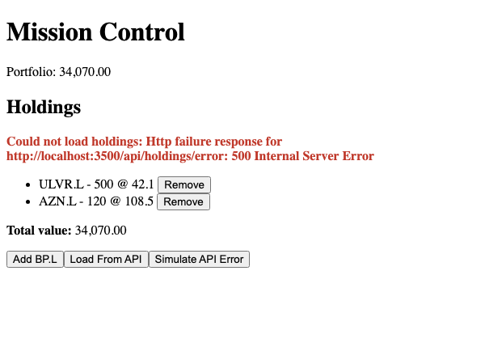

# Module 10 Demo Guide — HTTP Communication: HttpClient, Observables & Error Handling

**Duration:** 30 minutes
**Prerequisite:** Module 9's `Holdings` service and `PortfolioBadge`. Angular 21, TypeScript
5.9. This demo's `mock-server.js` running (`node mock-server.js`, no dependencies) — a real
mock API, not the Sprint 6 backend yet, that's Module 11.

Module 4 called a real backend with `fetch()`. Today does the same job with Angular's own
HTTP tool — `HttpClient` — and the pattern most Angular code actually uses: Observables.

## Part 0: A Real Mock API, on Purpose (3 min)

```javascript
// mock-server.js - plain Node http, no Express, no dependencies
const holdings = [
  { ticker: 'VOD.L', quantity: 800, price: 0.72 },
  { ticker: 'HSBA.L', quantity: 300, price: 6.4 },
];

if (req.url === '/api/holdings') { /* 200, real JSON */ }
if (req.url === '/api/holdings/error') { /* 500, real JSON error body */ }
```

Run it (`node mock-server.js`), curl both routes live. This is deliberately *not* the Sprint
6 Spring Boot service — Module 11 connects to that. Today isolates the one new idea:
`HttpClient` itself, against something simple and fully under control.

## Part 1: Wiring Up HttpClient (4 min)

```typescript
// app.config.ts
import { provideHttpClient } from '@angular/common/http';

export const appConfig: ApplicationConfig = {
  providers: [
    provideBrowserGlobalErrorListeners(),
    provideRouter(routes),
    provideHttpClient(),
  ],
};
```

Like `provideRouter` (Module 7), `HttpClient` has to be registered once at the application
level before anything can `inject()` it. One line, one time, anywhere in the app.

## Part 2: HttpClient vs fetch() — the Real Contrast (8 min)

```typescript
private readonly http = inject(HttpClient);

loadFromApi(url: string): void {
  this.http.get<Holding[]>(url).subscribe((data) => {
    this.holdings.set(data);
  });
}
```

Compare directly to Module 4's `fetch()`:

- **No `await response.json()`** — `http.get<Holding[]>(url)` already knows to parse JSON
  and gives back an `Observable<Holding[]>`, typed, in one call.
- **No manual `response.ok` check** — a non-2xx response doesn't quietly resolve the way
  `fetch()` does; it routes to a completely separate error channel (Part 3).
- **`.subscribe()` instead of `await`** — `HttpClient`'s methods return **Observables**, not
  Promises. Nothing runs until something subscribes — the request isn't even sent until
  `.subscribe()` is called. This is Observables' single biggest conceptual difference from
  the Promises Module 4 used: a Promise starts running the moment it's created; an Observable
  waits for a subscriber.

## Part 3: Error Handling — RxJS's catchError (7 min)

```typescript
import { catchError, of } from 'rxjs';

loadFromApi(url: string): void {
  this.http
    .get<Holding[]>(url)
    .pipe(
      catchError((error) => {
        this.loadError.set(`Could not load holdings: ${error.message}`);
        return of(null);
      }),
    )
    .subscribe((data) => {
      if (data) {
        this.loadError.set(null);
        this.holdings.set(data);
      }
    });
}
```

`.pipe()` chains **operators** onto an Observable — `catchError` intercepts an error before
it reaches `.subscribe()`, and *must* return a new Observable to keep the stream alive
(`of(null)` here — a one-value Observable). Without `catchError`, an HTTP error would
propagate to `.subscribe()`'s error callback instead (or go unhandled); with it, the error is
caught, recorded in a signal, and the stream completes normally with `null`.

## Part 4: Verified, Both Real Outcomes (6 min)

Click "Load From API":



The two seeded holdings from Module 8/9 are **replaced** by the mock server's real response —
`VOD.L` and `HSBA.L`, exactly what `mock-server.js` returns. The header badge (Module 9's
`PortfolioBadge`) updates too, still with zero code connecting the two components directly.

Click "Simulate API Error" instead:



The error message is real — `Http failure response for
http://localhost:3500/api/holdings/error: 500 Internal Server Error` — Angular's own error
object, not a hand-written string. Critically, the *existing* holdings are untouched: because
`catchError` returned `of(null)` and the subscribe callback only calls `.set()` when `data` is
truthy, a failed load doesn't wipe out what was already showing.

## Key message

`HttpClient` solves the exact same problem `fetch()` did in Module 4 — send a request, handle
success, handle failure — with Angular's own vocabulary: Observables instead of Promises,
`.pipe()`/operators instead of `try`/`catch`, and automatic JSON parsing instead of a manual
`response.json()` step. Nothing conceptually new about *what* HTTP communication requires;
everything about *how Angular expresses it* is different.

## Transition to the Lab

Learners add their own `HttpClient`-based method to their `Holdings` service, calling the
same mock server, handling both a successful load and a simulated failure — verified the same
way today's demo was, with both real outcomes actually run and screenshotted.
