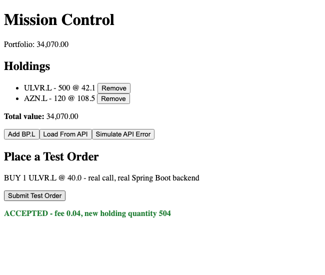

# Module 11 Demo Guide — Connecting to the Spring Boot Backend: First Real API Call

**Duration:** 25 minutes
**Prerequisite:** Module 9's DI pattern, Module 10's HttpClient/catchError pattern. A working
checkout of Sprint 6/7's mission service, `sprint6-postgres` running, and Sprint 8's
`sprint8-auth-service` — the same three pieces Module 5's whiteboard exercise already traced
by hand.

Module 10 called a mock server built for this sprint alone. Today calls the **real** thing —
the actual Spring Boot service every trader-facing feature ultimately depends on.

## Part 0: Two Real Services, CORS Enabled (4 min)

Two one-line additions, on the *server* side, mirroring Module 4's own CORS fix:

```java
// SecurityConfig.java, mission service
http.cors(cors -> cors.configurationSource(corsConfigurationSource()));

@Bean
public CorsConfigurationSource corsConfigurationSource() {
  CorsConfiguration configuration = new CorsConfiguration();
  configuration.setAllowedOrigins(List.of("http://localhost:4200"));
  ...
}
```

```typescript
// main.ts, sprint8-auth-service (Module 4's own fix, unchanged)
app.enableCors({ origin: "http://localhost:4200" });
```

Same lesson as Module 4: CORS is enforced by the browser, fixed on the server, never worked
around from Angular. Confirm both are up with `curl` before touching Angular at all — the
mission service returns a real `401` with no token, the auth service returns a real token
for `alice`/`mission123`.

## Part 1: A Service That Chains Two Real Calls (8 min)

```typescript
const AUTH_URL = 'http://localhost:3000/auth/login';
const MISSION_URL = 'http://localhost:8090/accounts/1/orders';

submitOrder(order: OrderRequest): void {
  this.http
    .post<{ accessToken: string }>(AUTH_URL, { username: 'alice', password: 'mission123' })
    .pipe(
      switchMap((auth) =>
        this.http.post<OrderResponse>(MISSION_URL, order, {
          headers: { Authorization: `Bearer ${auth.accessToken}` },
        }),
      ),
      catchError((error) => {
        this.error.set(`Order failed: ${error.message}`);
        return of(null);
      }),
    )
    .subscribe((response) => {
      if (response) this.lastOrder.set(response);
    });
}
```

`catchError` and `of(null)` are exactly Module 10's pattern, unchanged. The new operator is
`switchMap` — it takes the *result* of one Observable (the login response) and returns a
*second* Observable (the order submission) that depends on it. This is how Angular expresses
"do A, then use A's result to do B" — the login call must complete, with a real token, before
the order call can even be constructed. A hardcoded `alice`/`mission123` login is a
deliberate stand-in: Module 15 builds the real login form, JWT interceptor, and route guard
that replace this exact call.

## Part 2: A Component, Same DI Pattern as Every Prior Module (4 min)

```typescript
export class PlaceOrder {
  private readonly missionApi = inject(MissionApi);
  protected readonly lastOrder = this.missionApi.lastOrder;
  protected readonly error = this.missionApi.error;

  protected submitTestOrder(): void {
    this.missionApi.submitOrder({
      ticker: 'ULVR.L', instrumentType: 'EQUITY',
      quantity: 1, price: 40.0, side: 'BUY',
    });
  }
}
```

Nothing new here at all — `inject()` (Module 9), signals read straight from the service
(Module 9), a button calling a method (Module 8). The entire point of today is that the
*service* now talks to something real; the component didn't have to change shape to allow it.

## Part 3: Verified — A Real Row Changes in Postgres (6 min)

Query Postgres directly, before clicking anything:

```
account_id | ticker | quantity
------------+--------+----------
          1 | ULVR.L |  503.0000
```

Click "Submit Test Order" in the running app:



Query Postgres again, no other change made:

```
account_id | ticker | quantity
------------+--------+----------
          1 | ULVR.L |  504.0000
```

`503` → `504` — not asserted, queried twice, before and after, exactly like Module 5's own
verification. The number in the browser (`new holding quantity 504`) and the number in the
real database agree, because they're the same write.

## Key message

Nothing about *how* Angular talks to a backend changed between Module 10's mock and today's
real Spring Boot service — same `HttpClient`, same `catchError`, same DI-injected service,
same component pattern. What changed is what's on the other end: a real, persistent system
that Sprint 3, 5, 6, 7, and 8 already built and proved, one `curl` command at a time. Today
is the first time an Angular click reaches all the way through to a real database row.

## Transition to the Lab

Learners wire their own service layer to the same real endpoints, submit their own test
order, and verify the same way — a real Postgres query, before and after, not just a
green message on screen.
