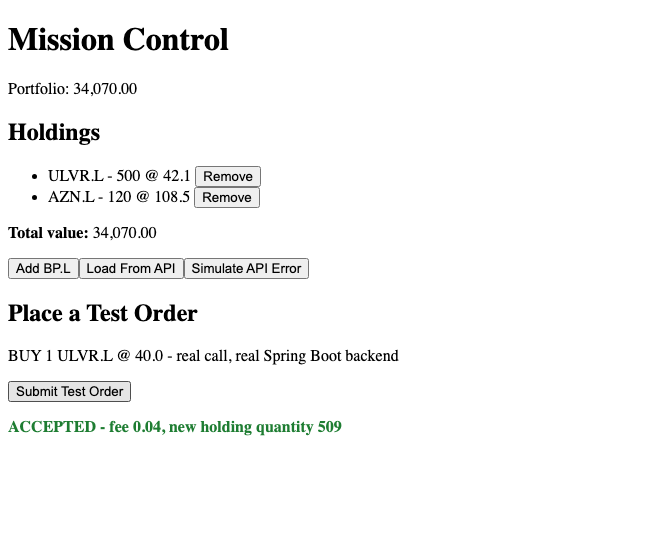

# Module 12 Demo Guide — OpenAPI-Generated API Clients

**Duration:** 25 minutes
**Prerequisite:** Module 11's `MissionApi`/`PlaceOrder`, hand-written against the real mission
service. Same running backends as Module 11.

Module 11 wrote the `POST /accounts/{accountId}/orders` call by hand — the URL, the body
shape, the response shape, all typed manually to match what the real service happened to
return. Today generates that entire client instead, from the service's own real, live
OpenAPI document.

## Part 0: A Real, Live OpenAPI Document — Not Hand-Written (5 min)

```xml
<!-- pom.xml -->
<dependency>
  <groupId>org.springdoc</groupId>
  <artifactId>springdoc-openapi-starter-webmvc-ui</artifactId>
  <version>2.6.0</version>
</dependency>
```

One dependency, no code changes — `springdoc` inspects the real, running controllers and
generates the spec from what's actually there. Fetch it live:

```bash
curl http://localhost:8090/v3/api-docs
```

Real output: `paths./accounts/{accountId}/orders.post` with the exact real path, the exact
real `OrderRequestDto`/`OrderResponseDto` field names — because it's reading them from the
real `@RestController`, not a document someone wrote once and forgot to update. Contrast this
directly with Sprint 6, Module 5's `order-service.yaml` — a **hand-written**, contract-first
spec for a *different*, never-built endpoint shape (`GET /orders/{id}`). That file describes
what someone once *intended*; today's spec describes what's *actually running*.

## Part 1: Two Small Server-Side Annotations (5 min)

Two real gaps needed fixing before the generated client would work correctly — not skipped,
fixed on the server, the same way Module 4 and Module 11 fixed real CORS gaps:

```java
// 1. Document the bearer scheme, so a generated client knows to attach a token
@SecurityScheme(name = "bearerAuth", type = SecuritySchemeType.HTTP,
                 scheme = "bearer", bearerFormat = "JWT")
public class MissionServiceApplication { ... }

@RestController
@SecurityRequirement(name = "bearerAuth")
public class OrderController { ... }

// 2. Declare the real response content type explicitly
@PostMapping(produces = MediaType.APPLICATION_JSON_VALUE)
public ResponseEntity<OrderResponseDto> submitOrder(...) { ... }
```

Verified, not guessed: without `produces = APPLICATION_JSON_VALUE`, the generated client
defensively treated the response as an untyped `blob`, and every field came back `undefined`
in the browser — a real broken first attempt, fixed by adding the one annotation Spring
should have had all along. This is real OpenAPI-generation feedback: the generator can only
be as accurate as what the server actually declares.

## Part 2: Generating the Client (5 min)

```bash
npx @openapitools/openapi-generator-cli generate \
  -i mission-service-openapi.json \
  -g typescript-angular \
  -o src/app/generated/mission-api-client \
  --additional-properties=ngVersion=21.0.0,providedInRoot=true
```

Real output: a full `OrderControllerService` with a typed `submitOrder(accountId: number,
orderRequestDto: OrderRequestDto): Observable<OrderResponseDto>` method, plus
`OrderRequestDto`/`OrderResponseDto` interfaces matching the real DTOs field-for-field —
generated, never hand-typed.

## Part 3: Replacing Module 11's Hand-Written Call (7 min)

```typescript
submitOrder(order: OrderRequestDto): void {
  this.http
    .post<{ accessToken: string }>(AUTH_URL, { username: 'alice', password: 'mission123' })
    .pipe(
      switchMap((auth) => {
        this.orderApi.configuration.credentials = {
          bearerAuth: () => auth.accessToken,
        };
        return this.orderApi.submitOrder(ACCOUNT_ID, order);
      }),
      catchError((error) => {
        this.error.set(`Order failed: ${error.message}`);
        return of(null);
      }),
    )
    .subscribe((response) => {
      if (response) this.lastOrder.set(response);
    });
}
```

`this.orderApi.submitOrder(...)` entirely replaces Module 11's manual
`this.http.post(MISSION_URL, order, { headers: {...} })` — no URL string, no manually-typed
response interface, no manually-attached header on every call. Setting
`configuration.credentials.bearerAuth` once, right after login, is what makes the generated
service attach `Authorization: Bearer <token>` **automatically** on every request from then
on — verified in DevTools' Network tab, not just assumed.

## Part 4: Verified — Same Real Outcome, Generated Instead of Hand-Written (3 min)



Identical real behaviour to Module 11 — same backend, same database, same accepted order —
proven by querying Postgres before and after, exactly as before. What changed is *how much of
this code a person had to write by hand*.

## Key message

A generated client isn't a different way of calling HTTP — it's the same `HttpClient`
underneath, with the URL, method, request body shape, and response shape all derived
automatically from a spec the server itself produces. The real payoff showed up today as a
real bug: a missing `produces` annotation broke the generated client in a way a
hand-written call (Module 11) would never have hit, because a hand-written call never had to
*infer* the response type from a declared content type — it just assumed JSON. That's the
trade a typed, generated client makes: much less code to write, but the server's own
declarations now matter in ways they didn't before.

## Transition to the Lab

Learners generate their own client from the same live spec, and replace their own Module 11
hand-written call with it — verifying the same way, a real order accepted, a real Postgres
row changed, and the same `Authorization` header confirmed in the Network tab.
