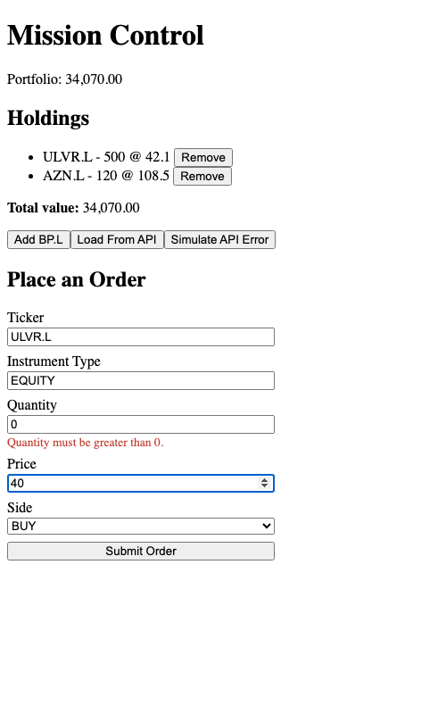
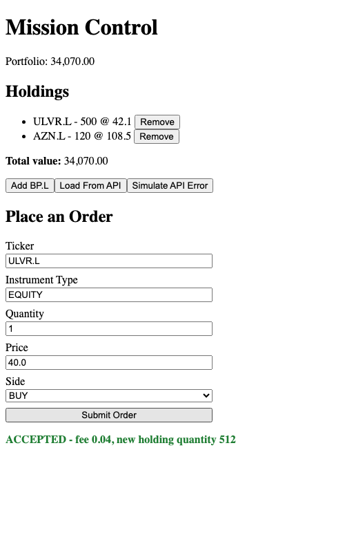
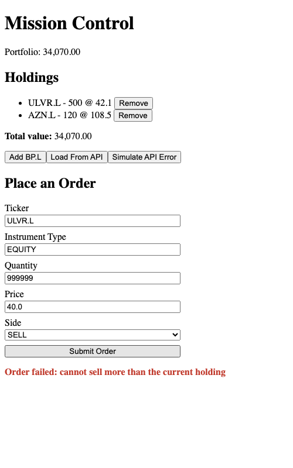

# Module 13 Demo Guide — Reactive Forms: Building, Submitting & Handling Responses

**Duration:** 30 minutes
**Prerequisite:** Module 12's `PlaceOrder` component and generated `OrderControllerService`.
Same running backends as Modules 11/12.

Every module since Module 11 has submitted the *same* hardcoded order with a single button.
Today replaces that with a real form — typed inputs, client-side validation, and two
genuinely different kinds of failure the UI has to tell apart.

## Part 0: From Day 1's Form to a Reactive Form (5 min)

Module 1 built a login form with native HTML: `required`, `minlength`, the browser's own
validation bubbles. Today's form uses the exact same *idea* — required fields, minimum
values — expressed through Angular's **reactive forms** instead:

```typescript
protected readonly orderForm = this.fb.group({
  ticker: ['ULVR.L', Validators.required],
  instrumentType: ['EQUITY', Validators.required],
  quantity: [1, [Validators.required, Validators.min(0.01)]],
  price: [40.0, [Validators.required, Validators.min(0.01)]],
  side: ['BUY', Validators.required],
});
```

`FormBuilder.group()` creates a `FormGroup` — a JavaScript object mirroring the form's shape,
holding both the current values and their validation state. This is "reactive" specifically
because the form model lives in the component class, not scattered across template
attributes — the template just *binds* to it.

## Part 1: Wiring the Template (5 min)

```html
<form [formGroup]="orderForm" (ngSubmit)="submit()">
  <input id="quantity" type="number" formControlName="quantity" />
  @if (orderForm.controls.quantity.invalid && orderForm.controls.quantity.touched) {
    <p class="field-error">Quantity must be greater than 0.</p>
  }
  <button type="submit">Submit Order</button>
</form>
```

`[formGroup]` connects the whole `<form>` to the `FormGroup`; `formControlName` connects each
`<input>` to one control inside it. `(ngSubmit)` replaces the native form submit event Module
1 used — same idea, Angular's own binding. The `.invalid && .touched` check is deliberate:
show the error only once the user has actually interacted with the field, not the instant the
form loads with an empty value.

Verified real output — an invalid quantity, live:



## Part 2: Submitting — Success (5 min)

```typescript
protected submit(): void {
  if (this.orderForm.invalid) {
    this.orderForm.markAllAsTouched();
    return;
  }
  const { ticker, instrumentType, quantity, price, side } = this.orderForm.getRawValue();
  this.missionApi.submitOrder({ ticker: ticker!, instrumentType: instrumentType!, ... });
}
```

`markAllAsTouched()` is what makes *every* field's error show up if someone clicks submit
without touching anything first — otherwise a completely empty, all-invalid form would show
no errors at all. Valid submissions flow straight into Module 12's generated client,
unchanged.

Verified real output — a valid BUY order, through the exact same real backend:



## Part 3: A Failure the Form Can't See Coming (10 min)

Submit a `SELL` order for `999999` shares of `ULVR.L` — a value the client-side form thinks
is perfectly valid (it's a positive number). Real output:



`cannot sell more than the current holding` — this is Sprint 5's `OrderValidator`, unchanged,
rejecting the order for real, because the *client* has no way to know how many shares the
account currently holds. This is the actual point of today's second half: client-side
validation (Part 0) catches shape problems — empty fields, non-positive numbers — but it can
never catch business rules that depend on server-side state. Both are necessary; neither
replaces the other.

## Part 4: Surfacing the Real Server Message (5 min)

```typescript
catchError((error: HttpErrorResponse) => {
  // error.message here is just Angular's generic wrapper -
  // not what the server actually said.
  const serverMessage = error.error?.message;
  this.error.set(`Order failed: ${serverMessage ?? error.message}`);
  return of(null);
}),
```

The first version of this code used `error.message` directly — which produced a generic
`Http failure response for ... 422` with no useful information. `error.error` is where
`HttpClient` puts the actual **response body** on a failed request; Sprint 6's
`GlobalExceptionHandler` (Module 10) always returns a real `{ status, error, message, path }`
object there. Reading `error.error?.message` is what surfaces the real
`cannot sell more than the current holding` text instead of a generic HTTP status line.

## Key message

A reactive form's validators and a server's business rules solve two different problems, and
today proved it with a real, triggerable example rather than asserting it: client-side
validation is about *shape* (is this a number, is it required), and it can be wrong or
incomplete about anything the server alone knows. Handling both a success and a real API
error clearly means reading the *actual* response body, not just trusting a generic error
object's default message.

## Transition to the Lab

Learners build their own reactive form for one mission use case, wire it to the real backend,
and verify all three states — client validation, a real success, and a real business-rule
rejection they deliberately trigger themselves.
