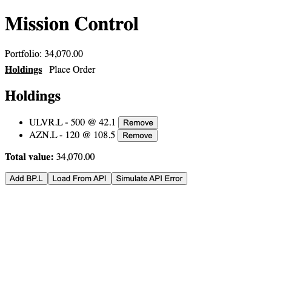
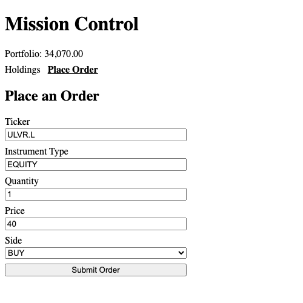

# Module 14 Demo Guide — Routing Fundamentals: Routes, Lazy Loading & Navigation

**Duration:** 25 minutes
**Prerequisite:** Module 13's `HoldingsSummary` and `PlaceOrder` components, both currently
shown at once, stacked in `app.html`.

Every module so far has shown `HoldingsSummary` and `PlaceOrder` on screen simultaneously,
because `app.html` includes both directly. A real application has more than one screen.
Today gives the mission app two, with a URL for each.

## Part 0: Defining Routes (5 min)

```typescript
// app.routes.ts
export const routes: Routes = [
  { path: '', redirectTo: 'holdings', pathMatch: 'full' },
  {
    path: 'holdings',
    loadComponent: () =>
      import('./holdings-summary/holdings-summary').then((m) => m.HoldingsSummary),
  },
  {
    path: 'orders',
    loadComponent: () =>
      import('./place-order/place-order').then((m) => m.PlaceOrder),
  },
];
```

Each route maps a URL path to a component. `redirectTo` sends the bare `/` somewhere real —
without it, visiting the app's root shows nothing, because no route matches an empty path on
its own. `pathMatch: 'full'` matters here specifically: without it, `''` would match the
*start* of every URL (including `/holdings`), redirecting endlessly.

## Part 1: Lazy Loading — loadComponent, Not import (5 min)

Point at the difference from every earlier `import { HoldingsSummary } from '...'` at the top
of a file: `loadComponent` takes a *function* returning a dynamic `import()`. The component's
code isn't fetched until the route is actually visited.

Real, verified output — `ng build`:

```
Initial chunk files | Names | Raw size
main-XQJI7J7G.js    | main  | 89.42 kB

Lazy chunk files    | Names            | Raw size
chunk-YTYNX2AW.js   | place-order      | 42.62 kB
chunk-DYAV5RE7.js   | holdings-summary |  1.97 kB
```

Two separate files, listed under **Lazy chunk files**, not bundled into `main.js` at all.
`PlaceOrder`'s reactive-forms code (Module 13) doesn't ship to a visitor who only ever looks
at their holdings.

## Part 2: Navigation — routerLink, Not href (5 min)

```html
<nav>
  <a routerLink="/holdings" routerLinkActive="active">Holdings</a>
  <a routerLink="/orders" routerLinkActive="active">Place Order</a>
</nav>
```

`routerLink` looks like a plain `href`, but it isn't one — clicking it asks Angular's router
to swap the `<router-outlet>`'s content without a full page reload (the same "no page reload"
idea Module 3's `preventDefault()` established, now built into the framework). `[routerLinkActive]="active"`
adds a CSS class automatically to whichever link matches the current URL — no manual
`if (currentRoute === ...)` anywhere.

## Part 3: Verified — Real Navigation, Real Lazy Loading (10 min)

Load the app fresh, watch the URL bar and the Network tab:



The URL reads `http://localhost:4200/holdings` — the redirect fired automatically. Click
"Place Order":



Verified via a real network listener during this exact click: no chunk containing
`place-order`'s code had loaded until this click happened — it loads for the first time
*here*, on demand, exactly as the `ng build` output predicted. The URL changed to `/orders`,
`routerLinkActive` moved the bold/underline styling to the second link, and the page never
reloaded.

## Key message

Routing turns a single-page app into something with real, bookmarkable, navigable screens —
`RouterOutlet` renders whatever the current URL maps to, `routerLink` changes the URL without
reloading, and `loadComponent` means a screen's code only ships to a browser that actually
visits it. All three ideas were verified today with real build output and a real click, not
just described.

## Transition to the Lab

Learners add at least two routed views of their own to the mission app (these two, or others
if they've built more components), wire up navigation between them, and verify the same way
— checking the Network tab for real lazy-loaded chunks, not just trusting that `loadComponent`
did what it claims.
